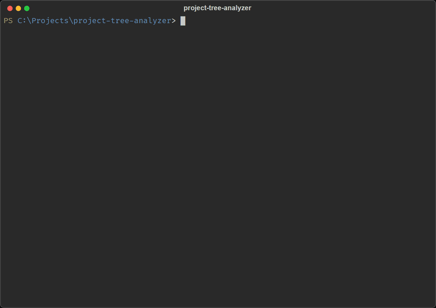

# Project Tree Analyzer

**English** | [Русский](README.ru.md)

[](https://github.com/Navruzbek05/project-tree-analyzer/actions/workflows/test.yml)
[](LICENSE)
[](https://www.python.org/)

An interactive terminal tool that shows your project's folder structure as a colorful tree with file sizes, icons and stats.



> The program's interface is currently in Russian. The prompts are simple: enter a path, then answer `y`/`n`.

## Features

- 📁 **Full project tree** of folders and files
- 📏 **Sizes in the tree**: every file's size and the total size of every folder
- 🌳 **Colorful output** powered by [rich](https://github.com/Textualize/rich), with icons and colors by file type
- 📊 **Stats panel**: number of folders and files, total size, scan time
- 🛡️ **Smart filtering**: skips hidden items and noise like `.git`, `node_modules`, `__pycache__`, `venv`, `build`, `dist`
- 🔍 Works on a single file too
- ✅ Windows, macOS and Linux (tested in CI)

## Requirements

- Python 3.9+
- [rich](https://pypi.org/project/rich/)

## Installation

```bash
git clone https://github.com/Navruzbek05/project-tree-analyzer.git
cd project-tree-analyzer
pip install -r requirements.txt
```

Or download an archive from [Releases](https://github.com/Navruzbek05/project-tree-analyzer/releases).

## Usage

```bash
python arch_analyzer.py
```

When asked for a path, enter one of:

| Input | Meaning |
|-------|---------|
| `C:\Users\Name\Projects\myapp` | Full path to a project |
| `.` | Current folder |
| `..` | Parent folder |
| `~/Documents/project` | Relative to your home folder |
| `%USERPROFILE%\Desktop` | With environment variables |
| `exit` / `quit` | Quit |

After the result, the program asks whether to analyze another project (`y`/`n`). `Ctrl+C` quits at any time.

## Example output

```
╭──────────────── myapp ─────────────────╮
│ Путь    C:\Users\Name\Projects\myapp   │
│ Тип     Папка                          │
│ Папок   6                              │
│ Файлов  7                              │
│ Размер  2.41 MB                        │
│ Время   0.15 сек                       │
╰────────────────────────────────────────╯
📦 myapp
├── 📂 src/  2.40 MB
│   ├── 📂 components/  40.0 KB
│   │   ├── ⚛ Button.jsx  12.0 KB
│   │   └── ⚛ Form.jsx  28.0 KB
│   ├── 📂 utils/  3.2 KB
│   │   └── 📜 helpers.js  3.2 KB
│   └── 📜 App.js  2.36 MB
├── 📂 tests/  6.1 KB
│   ├── 📂 integration/  0 Б
│   └── 📂 unit/  6.1 KB
│       └── 📜 helpers.test.js  6.1 KB
├── ⚙ package.json  1.2 KB
└── 📝 README.md  4.0 KB
```

(Путь = path, Тип = type, Папок = folders, Файлов = files, Размер = size, Время = time.)

## Excluded items

Hidden items (names starting with `.`) are skipped, plus these folders: `__pycache__`, `venv`, `node_modules`, `build`, `dist`,
and these files: `Thumbs.db`, `desktop.ini`. The lists live at the top of `ProjectAnalyzer.__init__` in
[arch_analyzer.py](arch_analyzer.py), so you can edit them there.

Scanning goes up to 10 levels deep. Items without access are marked `[Нет доступа]` (no access).

## Development

```bash
python test_arch_analyzer.py
```

Contributions are welcome! See [CONTRIBUTING.md](CONTRIBUTING.md) and the [CHANGELOG](CHANGELOG.md).

## License

[MIT](LICENSE) © 2026 Navruzbek
